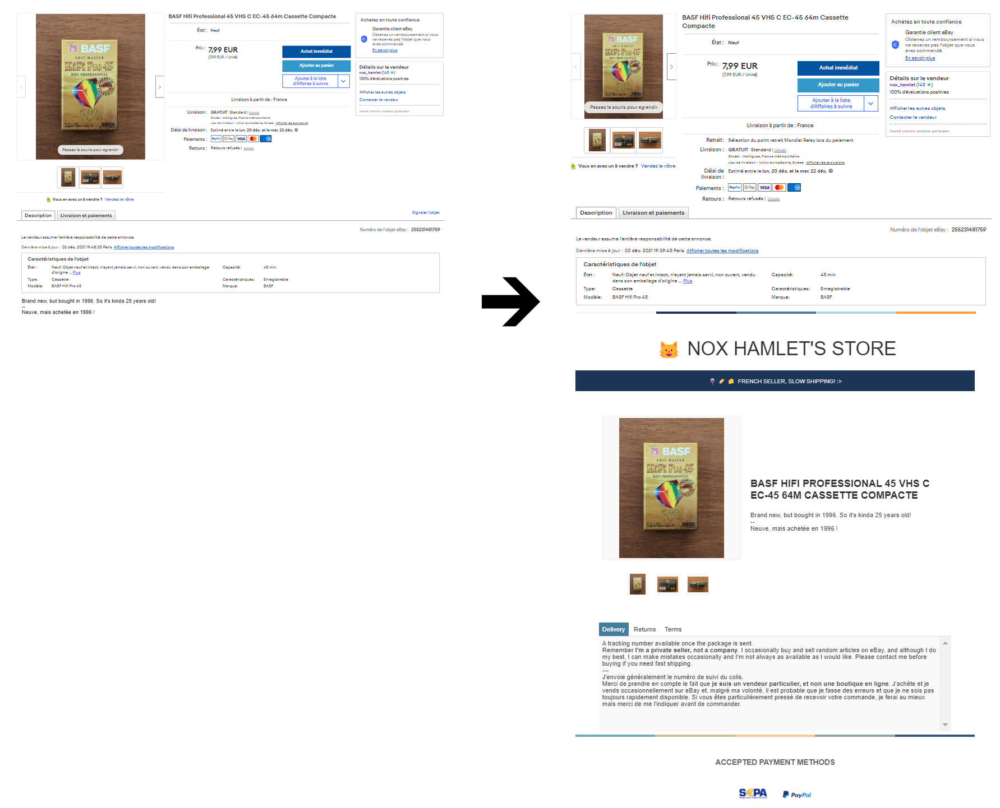

# EAG - Ebay Announce Generator
Automatically generate the announce description for you eBay items.
It will add a beautiful announce content, with pictures and colors.

A picture is worth a thousand words:



## Steps

- Create your product announce on eBay. Upload pictures and enter a textual description in the announce details.
- Publish your announce
- Run the script (see Run section below). It will create the HTML code for your announce
- Modify the previously created announce, and replace the HTML code
- Publish your announce again
- Profit!

Please contact me or raise an issue if you have any question!

## Features

- Automatically create a text file for each announce
- Does not create a file for already modified announces
- Archive old announces

## TODO

- Better templating (eg: shop name and details in a separate config file)
- Color choice
- You tell me, you can also send me a pull request!

## Run
### With docker-compose
`docker-compose up`

### With native python (Windows Powershell)
Create a virtual Python 3.7+ environment (venv) then:
```bash
.\venv\Scripts\activate.ps1
pip install -r requirements.txt
python -m eag
```
### With native python (Linux)
Create a virtual Python 3.7+ environment (venv) then:

```bash
source venv/Scripts/activate
python3 -m pip install -r requirements.txt
python3 -m eag
```
